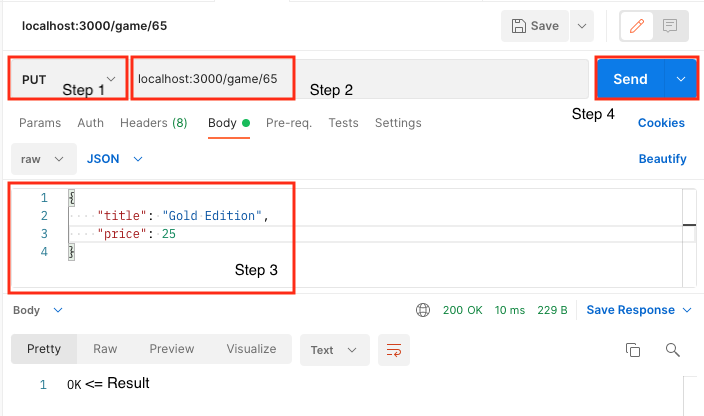

# Claviculario project

The main idea is build an embbeded system to provide a 'Key Bank Access'. Building the hardware and software, the project brings the technology to guarantee the user access and get the key from the box.

## Software

- Postman [Download](https://www.postman.com/downloads/) => Test HTTP protocol (GET, POST, DELETE...)

## Libraries 

- Body Parser => Read params and body req
- Express => Flexible framework;
- Nodemon => Update server automatically;

## Running API

- Run: `npm install`;
- Run: `nodemon index.js`;
- On web browser: `http://localhost:3000/games`

## testing API

### GET method: Getting all data
-  `http://localhost:3000/games/` => All data will be shown

### POST method: Registering data
- Go to Postman
- Set it as the picture below:

  

- Follow all steps and you'll see "Ok"
- Now, go to `http://localhost:3000/games/` and the new data will show up

### DELETE method: Deleting data

- Follow the same steps before but instead of using `POST` you can use `DELETE`
- Put the end-point `http://localhost:3000/game/1`
- Now, go to `http://localhost:3000/games/` and the data remaining will show up,

### PUT method: Update specific data

- Set it as the picture below:

  

- Follow all steps and you'll see "Ok"
- Now, go to `http://localhost:3000/games/` and the updated data will show up